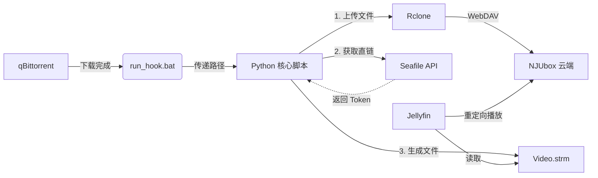

# 基于 NJUbox(Seafile) 的种子备份管理和流媒体包装服务

## 核心特性

⚡ **自动分流**：qBittorrent 下载完成后，自动调用 Rclone 上传至网盘。

🔗 **0流量播放**：通过 Seafile API 生成永久直链，创建 .strm 文件供 Jellyfin 等流媒体服务 / VLC 等本地播放器 直接读取，不消耗家庭上行带宽。

📂 **目录映射**：严格保持本地与云端的目录结构一致，完美支持多季番剧刮削。

🛡️ **混合存储**：支持本地 HDD 保种的同时，享受云端流媒体体验。

## 运行逻辑



## Windows 环境配置

### 1. 环境配置

*   **Python 3.x**: 下载安装 (务必勾选 **Add to PATH**).
*   **Rclone**: 下载 Windows 版，解压并将 `rclone.exe` 所在目录加入系统环境变量 **Path**。
*   **依赖库**:
    ```bash
    pip install -r requirements.txt
    ```

### 2. 关键配置

#### 1. 获取凭证

*   **API Token**: 网页版 -> 设置 -> API Token (用于生成链接).
*   **Repo ID**: 浏览器进入资料库，URL `/library/` 后面的 UUID.
*   **Repo name**: 默认为"私人资料库".

#### 2. 配置 Rclone

在 CMD 中运行 `rclone config`，配置 WebDAV 连接到 `https://box.nju.edu.cn/seafdav`, 或者 Seafile 配置用户名密码登陆 (URL 无后缀)

*   **注意**: 资料库名称应当为 `私人资料库`

⚠️ **验证测试**，运行以下命令列出云端目录。如果报错，请检查 Rclone 配置。

```bash
rclone lsd NJUbox:
```

#### 3. 项目配置 (config.yaml)

将 `config/config.example.yaml` 重命名为 `config/config.yaml` 并填入信息.

### 3. 手动测试

拖拽测试, 任意视频文件拖拽到 `run_hook.bat` 上,应该可以在指定目录生成 `[Stream]*.strm` 文件.

### 4. qBittorrent集成

在 qBittorrent "下载完成后运行外部程序" 中填入:
```dos
"D:\你的项目路径\run_hook.bat" "%F"
```
